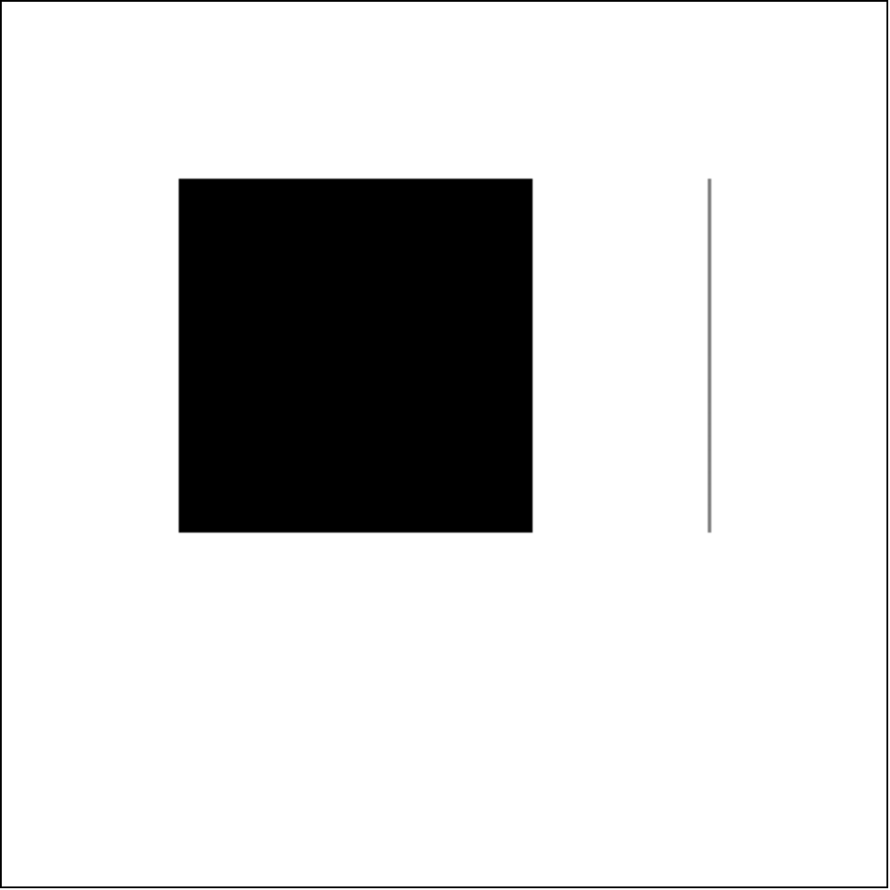

#Advanced HTML5 and CSS3
- HTML5 is more than just tags and attributes.
- HTML5 wraps in a rich JavaScript API that helps you push front-end work to the limit.

##Detect HTML5 Features
- In order to use any of the exciting HTML5 features you should make sure they are available on the target browser.
- There are in-built ways to do this, and also a library called Modernizr that makes it easier.

##In-Built Feature Detection
- Check if a certain property exists on a global object (window or navigator for example).
	- Example: Check for geolocation support on the navigator object.
- Create an element, then check if a certain property exists on that element.
	- Example: Test for canvas support.
- Create an element, check if a certain method exists on that element, then call the method and check the value it returns.
	- Example: Test which video formats are supported.
- Create an element, set a property to a certain value, then check if the property has retained its value.
	- Example: Testing which `<input>` types are supported.

##Feature Detection with Modernizr
- Let's take a look at the [Modernizr documentation](http://modernizr.com/).
- Modernizr can detect JavaScript capabilities in addition to CSS3 capabilities.
- Let's take a look at some of the things you can detect:

Canvas Support:

```
Modernizr.canvas
```

Geolocation Support:

```
Modernizr.geolocation
```

Specific Video Formats:

```
Modernizr.video.h264
```

CSS3 Font Face:

```
Modernizr.fontface
```

3D Transforms:

```
Modernizr.csstransforms3d
```

##Browser Storage
- HTML5 has a nice API for storing data locally.
- This substitutes using cookies for storing application-related information.
- There are two main ways - localStorage and sessionStorage, which are part of the global `window` object.
- WebSQL is a cutting-edge SQL data store on the client side that is currently only available on Chrome.

##LocalStorage
- localStorage is essentially a object-based persistent data store.
- You can store up to 5MB of data in localStorage.
- All data is stored in string format only (no objects or arrays).
- localStorage data is persisted until it is cleared either programmatically or manually.
- Let's look at some getter and setter methods for using it:

```
window.localStorage.setItem("key", "value");

window.localStorage.getItem("key");
```

##SessionStorage
- sessionStorage is much like localStorage except it only persists for the current "session."
- When the browser is closed sessionStorage is cleared.
- It has similar getter and setter methods:

```
window.sessionStorage.setItem("key", "value");

window.sessionStorage.getItem("key");
```

##Exercise: Todo List
- Let's create a todo list app using localStorage.
- The HTML is already prepared for you [here](todo_html/).

##HTML5 Canvas
- Canvas allows many kinds of image manipulation through JavaScript.
- You can create static images or dynamic scenes.
- Canvas currently only supports 2D scenes but may support 3D scenes in the near future.

##Canvas Exercise: A Simple Drawing
- We will use canvas to draw a simple line and rectangle.
- The final result will look like this:



Step 1: Select the canvas element

```
var canvas = document.getElementById("my-canvas");
```

Step 2: Get the canvas "context"

```
var canvas_context = canvas.getContext("2d");
```

- The context is what you draw on using JavaScript.

Step 3: Fill the rectangle onto the context

```
canvas_context.fillRect(100, 100, 200, 200);
```

Step 4: Create the line

```
canvas_context.beginPath();

canvas_context.moveTo(400, 100);

canvas_context.lineTo(400, 300);

canvas_context.stroke();
```

##Kinetic JS: A Canvas API
- Canvas is not incredibly intuitive to use, and there is quite a lot you can do with it.
- Canvas APIs such as KineticJS, PaperJS, and RaphaelJS are commonly used to maximize the canvas potential.
- We will be practicing using KineticJS to create a scene of rectangles that are draggable:


Everything in Kinetic starts with a "stage" that will contain the canvas:

```
var stage = new Kinetic.Stage({
	container:'container',
	width:700,
	height:500
});
```

Next we need to create a layer to add elements too:

```
var layer = new Kinetic.Layer();

stage.add(layer);
```

Add rectangles to layer:

```
for (var i = 0; i < 10; i++) {
	var rect = new Kinetic.Rect({
		x:10 + (i * 20),
		y:10 + (i * 20),
		width:100,
		height:80,
		fill:"#900",
		draggable:true,
		stroke:"#000000",
		strokeWidth:2
	});

	layer.add(rect);
	layer.draw();
}
```

With canvas you can even save the entire stage to JSON to be retrieved at a later time:

```
localStorage.setItem("rectangle_sample", stage.toJSON());
```